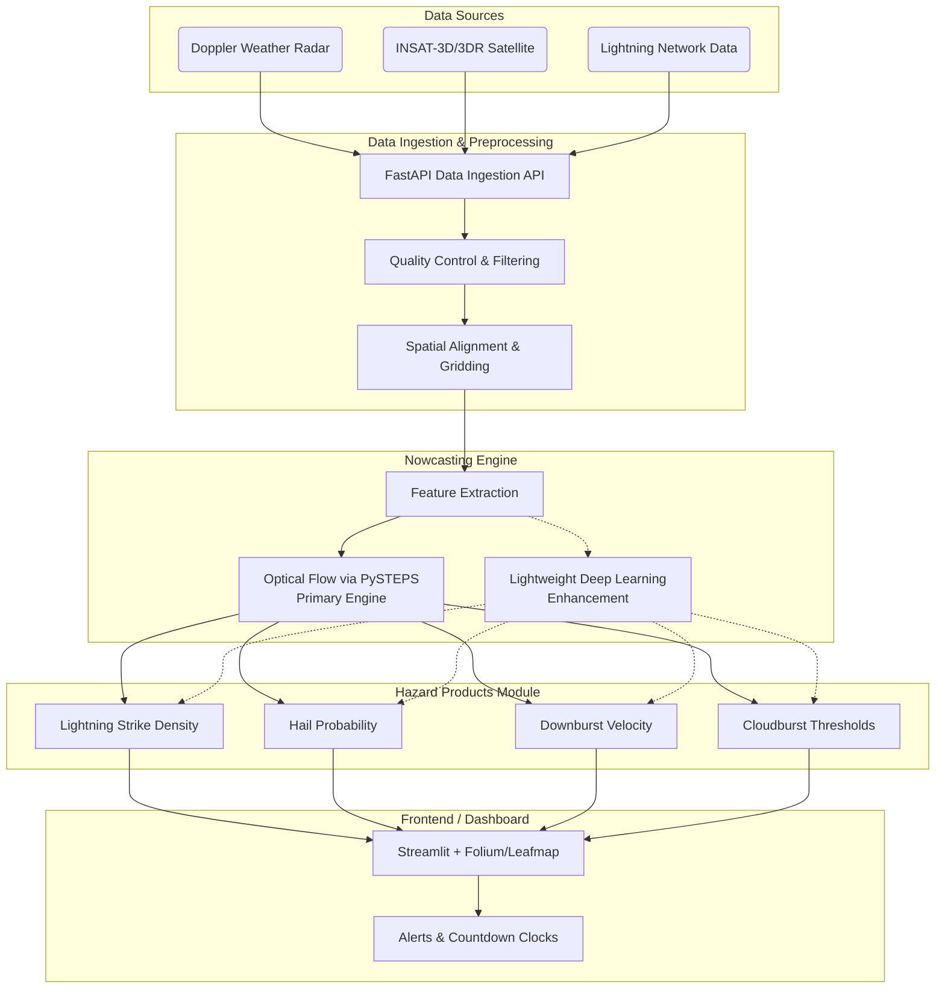

# System Architecture

The NowCast Fusion system is designed as a modular pipeline to handle real-time data ingestion, processing, nowcasting inference, and interactive visualization.

## High-Level Architecture

## Module Breakdown

1. **Ingestion & Preprocessing:** Fetches raw data (or simulated historical data) via APIs, applies quality control to remove clutter, and aligns multimodal data onto a common 1–3 km grid over the target region (North-East India / Assam).
2. **Nowcasting Engine:**
   - *Primary (Optical Flow):* Utilizes PySTEPS for fast, reliable kinematic tracking and extrapolation of radar/satellite fields for the +1 to +2 hour timeframe.
   - *Enhancement (Deep Learning):* A lightweight sequence-to-sequence model to capture non-linear growth for extended lead times, integrated as resources permit.
3. **Hazard Products:** Applies established meteorological thresholds and empirical algorithms to the engine's output to classify specific hazards (e.g., high reflectivity paired with sub-zero thermal data indicates hail).
4. **Dashboard:** A Python-based interactive GIS dashboard using Streamlit and Folium/Leafmap. This enables rapid iteration and seamless integration with the Python data science backend, rendering geospatial hazard products and real-time alerts.

## Technology Choices
- **Backend & ML Pipeline:** Python (FastAPI, PySTEPS, PyTorch).
- **Dashboard:** Streamlit (Primary for rapid prototyping).
- **Database:** PostgreSQL with PostGIS (for spatial querying and alert zones).
