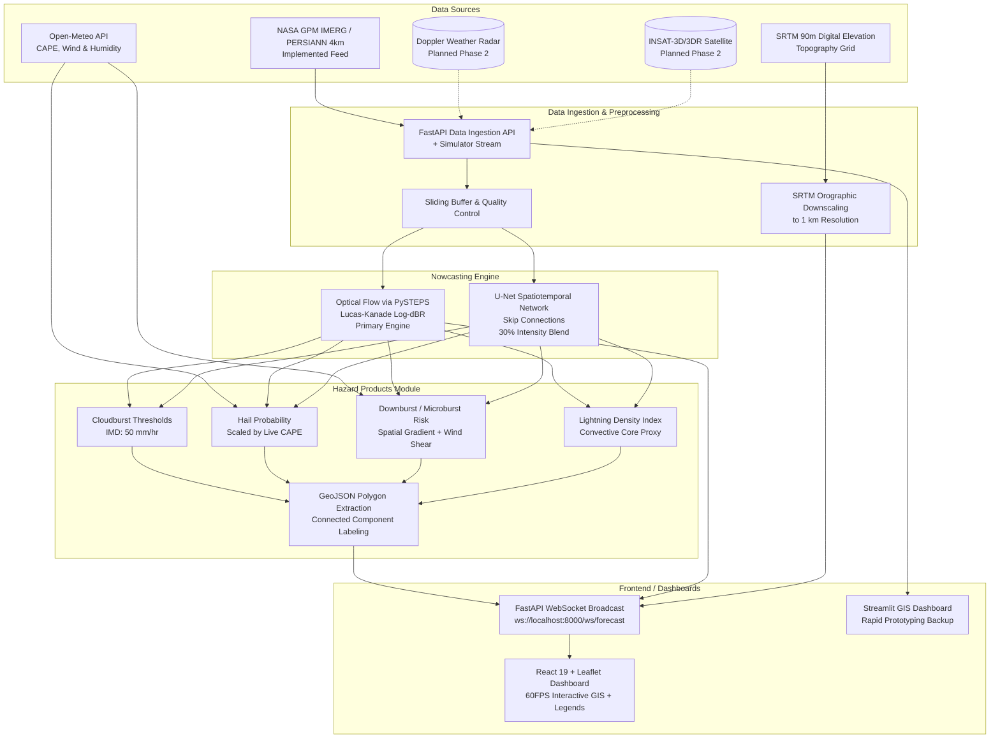

# System Architecture

The NowCast Fusion system is designed as a modular, real-time pipeline handling multi-source meteorological data ingestion, physical and deep learning inference, and interactive GIS visualization.

## High-Level Architecture

## Module Breakdown

1. **Ingestion & Preprocessing:**
   - Ingests high-resolution satellite precipitation frames via REST or replayed historical squall lines via the event simulator.
   - Maintains an in-memory sliding buffer of the latest radar/satellite frames.
   - Downscales precipitation grids to ~1 km using SRTM elevation profiles to account for orographic lift along the Himalayas and Meghalaya plateau.

2. **Nowcasting Engine (Hybrid Multi-Source):**
   - *Primary (Optical Flow):* Uses PySTEPS Lucas-Kanade optical flow in logarithmic dBR space to advect convective cells forward up to +6 hours.
   - *Secondary (Deep Learning):* A 7-stage U-Net (`UNetNowcast`) with encoder-decoder skip connections captures non-linear convective growth/decay, blended at 30% with the advection field for the +30 to +90 min window.

3. **Hazard Products Engine:**
   - **Cloudburst Risk:** Calibrated against the IMD standard (≥100 mm in 3 hours).
   - **Hail Probability:** Scaled using real-time atmospheric instability (CAPE > 1000 J/kg from Open-Meteo).
   - **Downburst Risk:** Combines instantaneous precipitation intensity, sharp spatial gradient, and 10m surface wind shear.
   - **Lightning Density:** Convective core intensity proxy (>10 mm/hr) indicating cloud-to-ground electrical discharge.
   - **GeoJSON Extraction:** Generates vector alert polygons with centroids for emergency management.

4. **Frontend & Visualization:**
   - **React 19 + Leaflet Dashboard:** High-performance dashboard with continuous WebSocket updates, interactive layer overlays, city ETA countdown cards, and meteorological color scale legends.
   - **Streamlit App:** Python-native GIS dashboard for exploratory data analysis.

## Technology Stack

- **Backend:** Python 3.14, FastAPI, Uvicorn, Pydantic v2 Settings.
- **Meteorology & CV:** PySTEPS, OpenCV, SciPy, MetPy, Rasterio, Open-Meteo API.
- **Deep Learning:** PyTorch (U-Net with Batch Normalization & Skip Connections).
- **Frontend:** React 19, Vite, Leaflet, Tailwind CSS, Lucide Icons.
- **Testing:** Pytest, HTTPX, FastAPI TestClient.
